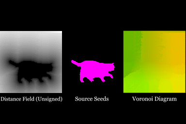
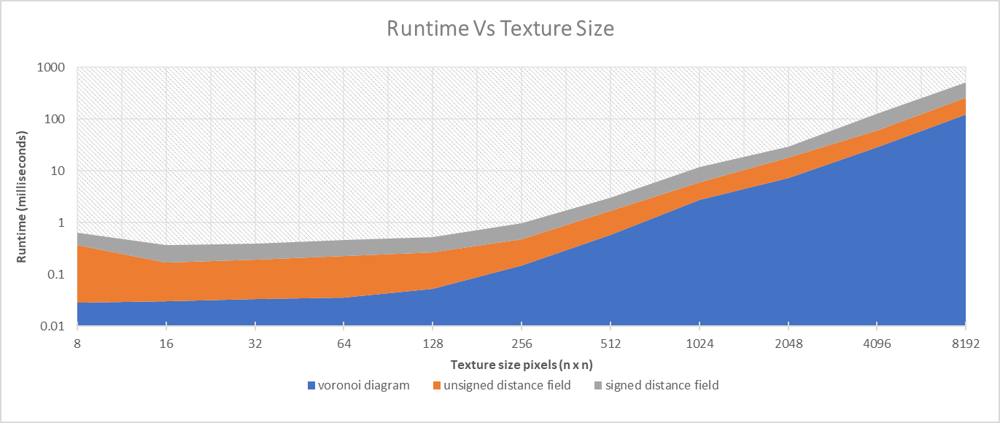
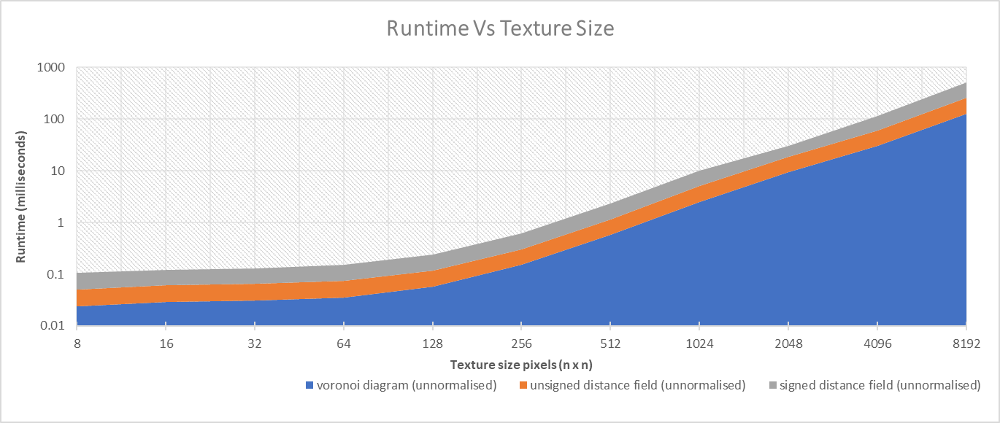

# IMG2SDF



A small utility for generating (un)signed distance fields
and voronoi diagrams using the Jump Flood algorithm. 
Implemented in DX11 compute shaders.

## Building
This project uses CMake. It depends on the Windows Runtime Library,
and the DX11 toolkit. Other external dependencies include argparse
and googletest, which are automatically downloaded by CMake.

A number of targets are provided:
`libimg2sdf`: The main library. Compiled as a static lib,
the primary interface is through the `img2sdf.h` header.

`img2sdf`: this is a utility command line tool that will
generate normalised unsigned distance field or voronoi diagram
from the input image path provided. 

`profile`: A small profiling program that reports timings
for the various algorithms used in this project.

`test`: Test cases used in this project.

## Usage

Link against `libimg2sdf`. Include the `img2sdf.h` header.
Initialise the `Img2SDF` object with your DX11 device and context. Note that `Windows::Foundation::Initialize` must have been called
at program startup. Call the method
of your choice with an input `ID3D11Texture2D` to get back a computed
`ID3D11Texture2D`:
```cpp
    ///initalise your device, context and texture somewhere up here...
    Img2SDF img2sdf {device.Get(), context.Get()};
    ComPtr<ID3D11Texture2D> out_texture = img2sdf.compute_signed_distance_field(in_texture);
```
The input texture must have a size of a power of 2, and must be an R32 float texture. Any pixel
that is non-zero is treated as an input seed.

## Results

Below are the coarse timings for the jumpflooding functions provided. These were created
by generating seed textures with random distributions of seed pixels of varying sizes, and
computing each of the functions for them. Timing information is retrieved using the technique described here: https://therealmjp.github.io/posts/profiling-in-dx11-with-queries/


| Function Name           | 8x8                  | 16x16   | 32x32               | 64x64   | 128x128 | 256x256             | 512x512 | 1024x1024 | 2048x2048          | 4096x4096 | 8192x8192          | units       |
|-------------------------|----------------------|---------|---------------------|---------|---------|---------------------|---------|-----------|--------------------|-----------|--------------------|-------------|
| voronoi diagram         | 0.028079999999999997 | 0.03032 | 0.03368             | 0.03532 | 0.05328 | 0.14976             | 0.58284 | 2.75704   | 7.25924            | 28.5062   | 123.14176          | milliseconds |
| unsigned distance field | 0.34445              | 0.13625 | 0.16032000000000002 | 0.19394 | 0.20943 | 0.32482             | 1.10505 | 3.2116    | 10.792629999999999 | 31.24162  | 133.71495          | milliseconds |
| signed distance field   | 0.26050999999999996  | 0.20677 | 0.19284             | 0.23734 | 0.2691  | 0.48718999999999996 | 1.3873  | 6.05148   | 11.25882           | 65.52313  | 257.50334000000004 | milliseconds |
Graphed below (log scale):


This demonstrates a loglinear performance, which matches the big-O bounds for the algorithm. 
For small textures, the runtime is dominated by the minmax reduction that needs to be done to normalise the output,
particularly as my implementation falls back to a serial (CPU) minimax algorithm when the reduction produces a UAV smaller than
a wavefront (8x8 pixels). This means that the benefits of a parallel reduction don't really start to appear until our textures
are 128x128 pixels in size. 

| Function Name           | 8x8                  | 16x16   | 32x32               | 64x64   | 128x128 | 256x256             | 512x512 | 1024x1024 | 2048x2048          | 4096x4096 | 8192x8192          | units       |
|-----------------------|--------------------|-------|-------------------|-------|-------|-------------------|-------|-------|------------------|--------|------------------|-------------|
|voronoi diagram (unnormalised)|0.02448             |0.02624|0.34016            |0.0318 |0.0504 |0.14695999999999998|0.56108|2.43788|10.473680000000002|30.17116|122.79082         |             |
|unsigned distance field (unnormalised)|0.00792             |0.014199999999999999|0.015359999999999999|0.01764|0.0276 |0.14504            |0.5738800000000001|2.75936|8.78908           |27.847839999999998|124.64032         |milliseconds|
|signed distance field (unnormalised)|0.019559999999999998|0.06148|0.057080000000000006|0.06548|0.11120000000000001|0.29035999999999995|1.1581199999999998|5.60756|9.04504           |53.92588|251.42989         |milliseconds|


Removing the normalisation pass eliminates most of this overhead for small textures. Computing the signed
distance field takes double the time as the current implementation performs two separate unsigned distance passes, one on an inverted source,
and composites the result in later. This can most likely be merged into a single pass.

## References
https://therealmjp.github.io/posts/profiling-in-dx11-with-queries/
https://blog.demofox.org/2016/02/29/fast-voronoi-diagrams-and-distance-dield-textures-on-the-gpu-with-the-jump-flooding-algorithm/
https://www.comp.nus.edu.sg/~tants/jfa/i3d06.pdf 